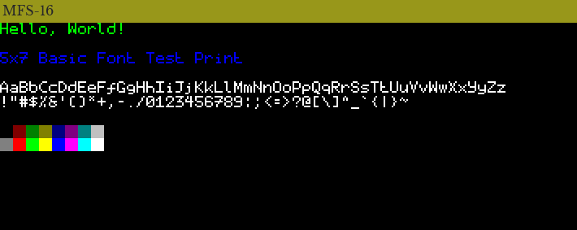
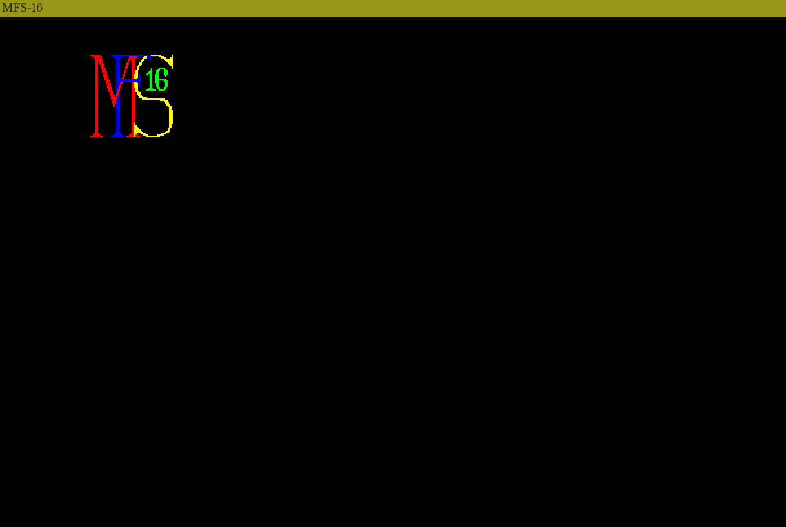
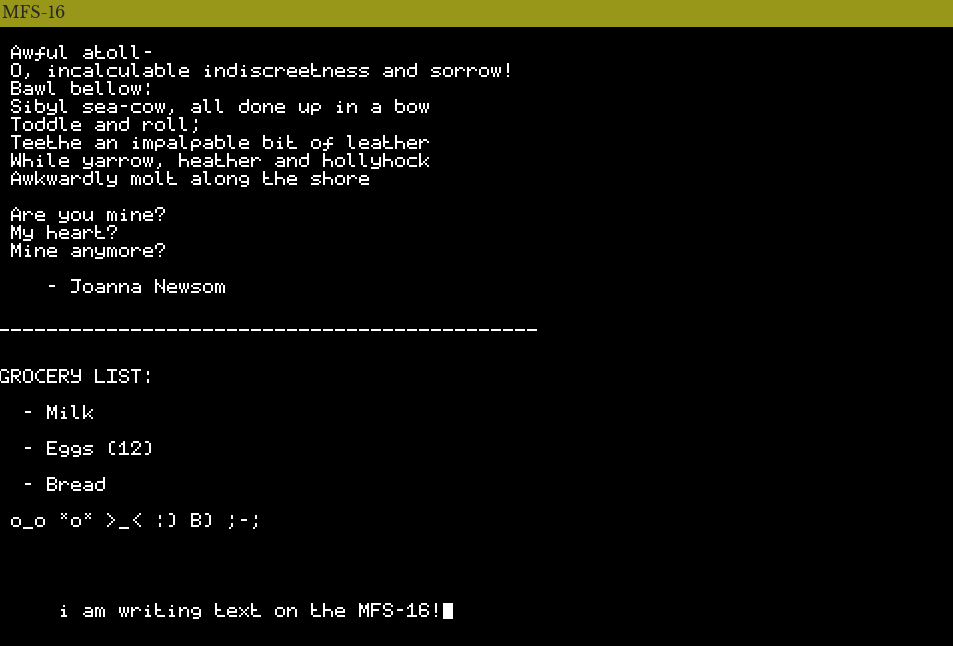

# Demo Programs

The MFS-16 repository contains some compiled demo programs in the `programs/` directory. The assembly source files are included as well.

- **fibonacci:** The first-ever MFS-16 program! Calculates the 12th Fibonacci number and stores it in the L register. No graphical output.

- **hello_world:** Displays some text and the 16-colour palette.

- **pixel_test:** Covers the screen with some colourful gaudy lines to make sure the screen is working. May cause eyestrain.

- **bouncing_ball:** An ugly "ball" that bounces around the screen.

- **bouncing_logo:** Bounces the MFS-16 logo around the screen.

- **toggle_screen:** Displays the same awful pattern as `pixel_test`, but the pattern can be switched on and off with a key press.

- **kb:** The bare-minimum keyboard test. Lights up pixels on the screen corresponding to pressed keyboard keys.

- **scribe:** Type and erase text! File saving coming soon...

- **promenade:** Move a colourful square around the screen.
